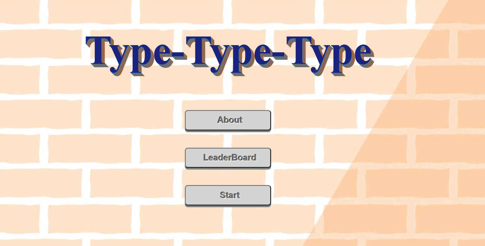
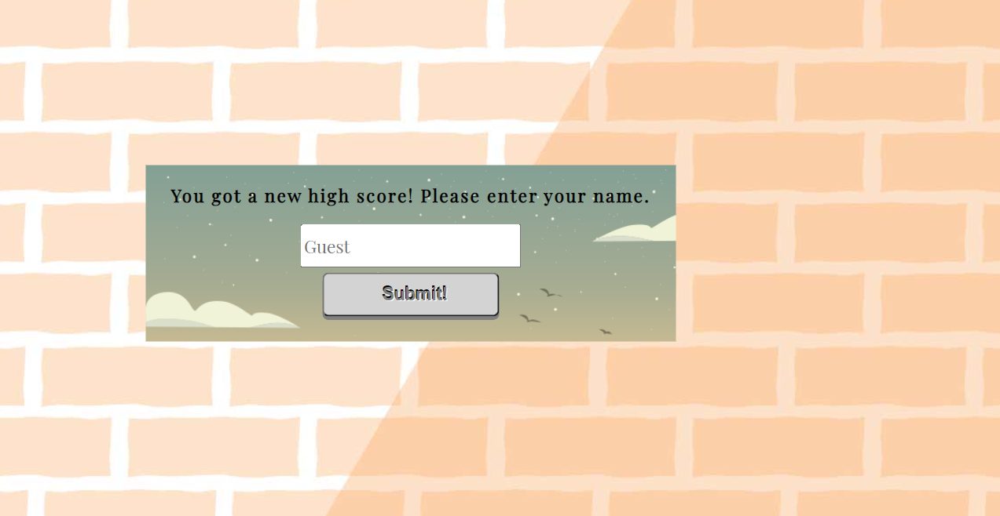

# Typing-game

## Game Description

This is a typing game which the player required to use keyboard and type the given sentence before the bomb exploded. Every completed sentence will trigger the speed of the falling bomb increases.

## Game Link

https://kienwei96.github.io/Typing-game/html/index.html

## Technologies

- **HTML**
- **CSS**
- **Javascript**
- **Jquery** is used to manage DOM manipulation
- **Jquery UI** is used for shake effect
- **Ajax** is used to request and access random sentence from the API library

## API used

[https://api.chucknorris.io/jokes/random](https://api.chucknorris.io/)
The **API** is used to randomly generate a sentence for the game.

## Accomplishments

- Learnt about canvas rendering 2D context
- Replace prompt box with modal box
- Apply OOP
- The sentence are randomly generated every time by calling public API.
- The Top 5 highest score able to keep record(even though reload the page) by using local storage.

## Game Instructions

- Press the 'start' button to start the game.
- The bomb will started falling from the top when 'start' button was pressed.
- Type the sentence as per appear in the game.
- Keep typing until the bomb has exploded.

## User Stories

1. The player will see the completed loaded page of the game as below. There is 'About' button for player to understand how the game run. There is alos a 'Leaderboard' button for player to check the Top 5 High Scores of this game.
<table><tr><td>
  
  </td></tr></table>

2. Player will has to press the 'Start' button to start the game. Once the game started, a sentence of word will appeared at the bottom left inside the canvas and a bomb will start falling down.
<table><tr><td>
   
  </td></tr></table>

3. When the bomb touched the ground and exploded, the game is over.
<table><tr><td>
   
  </td></tr></table>

4. If there is any new high scores achieved, there will be a modal box prompt to inform player that he/she beat one of the top 5 high scorers and request players to enter their respective name for the leaderboard update.
<table><tr><td>
   
  </td></tr></table>

5. Once the game is over, the new achieved score and a 'Play Again' button will appear in the pop out box. Also, the highest score will be displayed on the top of the frame. In order to play again or back to starting page, player would just need to click the 'Play Again' button.
<table><tr><td>
   
  </td></tr></table>

6. Player can check for the Top 5 High scores by clicking the 'LeaderBoard' button. The LeaderBoard was created to display only the top 5 high scores which including the player name and score. The order is followed by the highest score record to the lowest score record.
<table><tr><td>
   
  </td></tr></table>

## What to improve for a better game experience

- Use requestAnimationFrame() instead of setInterval to prevent the image from flicking
- To create more frame or game mode (such as timer mode) to make it more interesting
- Create a more attractive prompt box for player to enter their name when achieved a new high score
